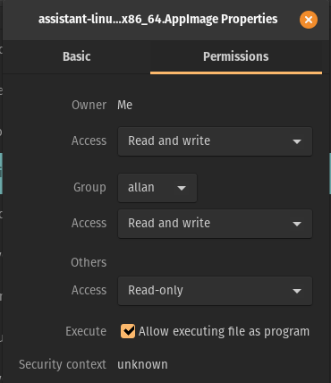

# openiap assistant

Download for

[🪟windows](https://github.com/openiap/assistant/releases/latest/download/assistant-win.exe)
[🐧linux](https://github.com/openiap/assistant/releases/latest/download/assistant-linux-x86_64.AppImage)
[💻macos M1/M2](https://github.com/openiap/assistant/releases/latest/download/assistant-macos-arm64.dmg)
[💻macos x64](https://github.com/openiap/assistant/releases/latest/download/assistant-macos-x64.dmg)

On liux, remember to right click the appimage and allow execution

